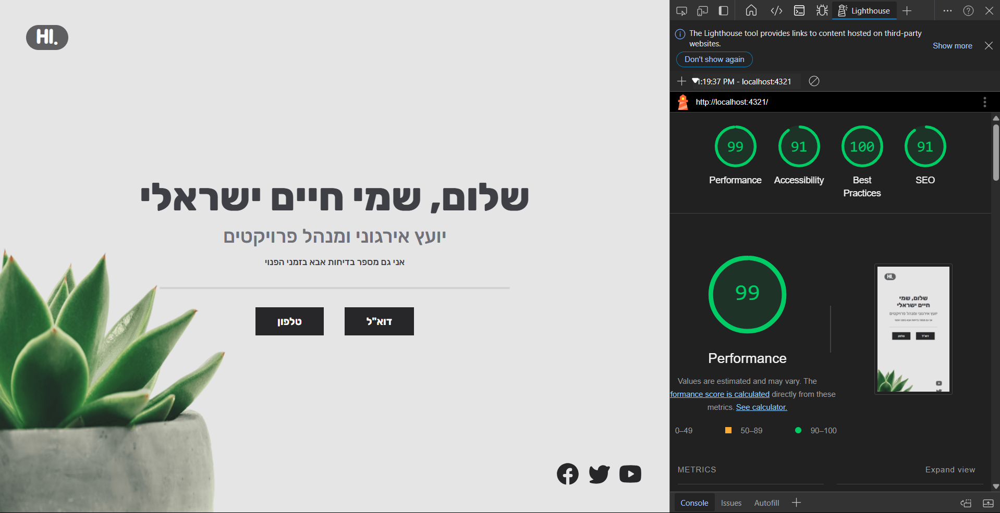

# 🌱 Elegant Sprout


A clean and elegant portfolio site built using **Astro** and **TailwindCSS**, with full support for **Hebrew** and right-to-left (RTL) layouts.



## ✨ Features

- 💡 Minimalistic and clean design
- 📱 Fully responsive layout
- ⚡ Fast loading with Astro's optimization
- 🎨 Easily customizable with TailwindCSS
- 🇮🇱 **Built-in Hebrew and RTL support**

## 🚀 Tech Stack

- **Astro** - A modern static site generator
- **TailwindCSS** - Utility-first CSS framework

## 📸 Screenshots

Here’s a sneak peek of the **Elegant Sprout** portfolio:

### Desktop View


### Mobile View


## ⚙️ Installation

**Clone the repository**:

```bash
git clone https://github.com/MosheRivkinDev/elegant-sprout.git
```
